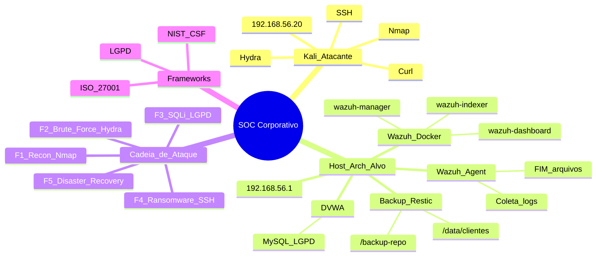
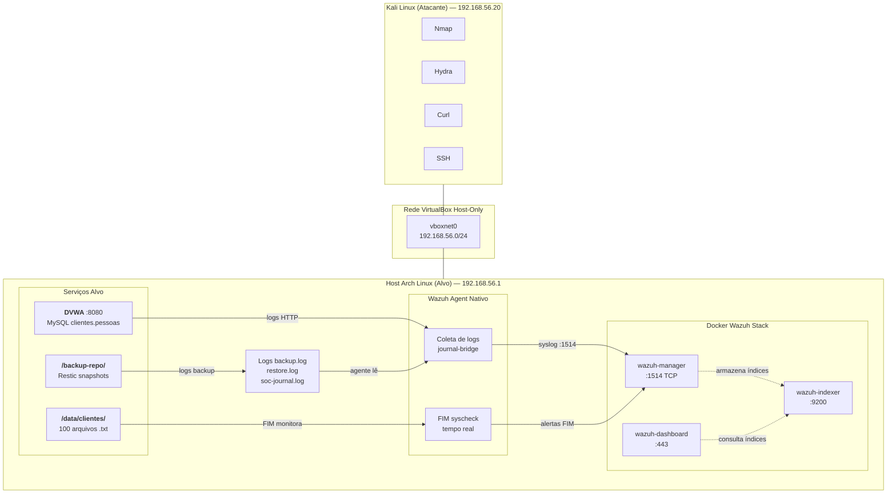
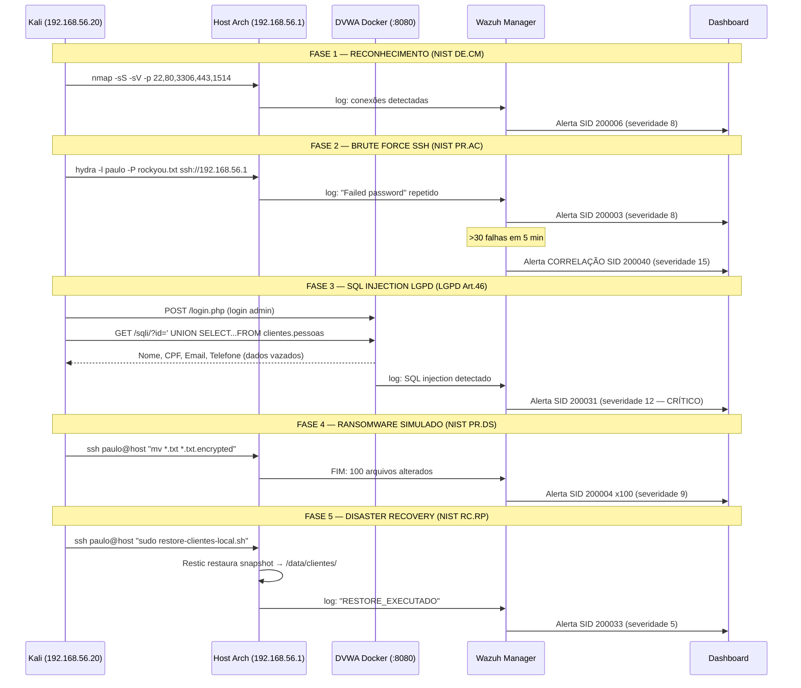
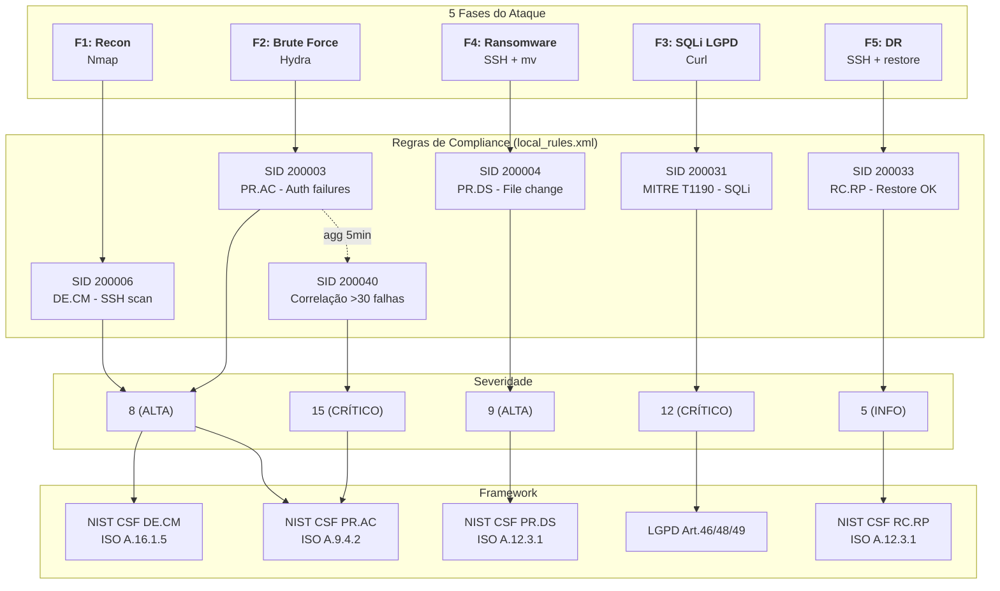
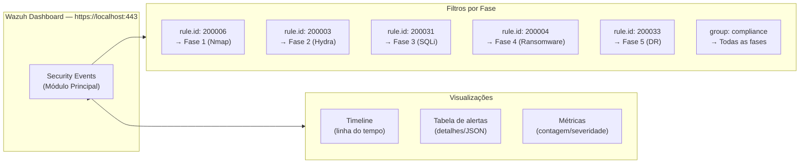
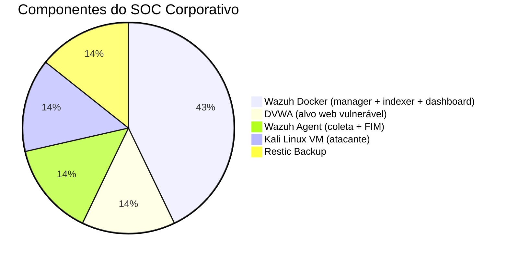
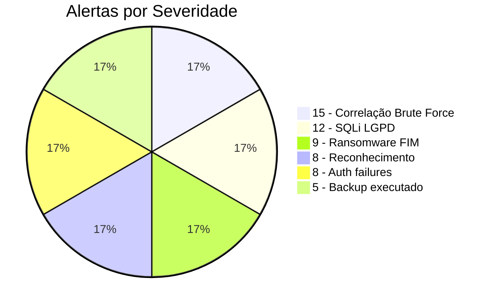

# Mapa Mental — SOC Corporativo (Mermaid)



---

## Arquitetura do Ambiente



---

## Pipeline de Detecção (Fluxo de Dados)

```mermaid
flowchart LR
    subgraph MUNDO["Mundo Real"]
        EV1[("F1: Nmap<br/>Varredura portas")]
        EV2[("F2: Hydra<br/>Brute force SSH")]
        EV3[("F3: Curl<br/>SQL Injection")]
        EV4[("F4: SSH mv<br/>Ransomware")]
        EV5[("F5: SSH restore<br/>Disaster Recovery")]
    end

    subgraph FONTES["Fontes de Log no Host"]
        JB[journal-bridge<br/>journalctl -f]
        AL[/var/log/auth.log]
        SYS[syscheck FIM]
        BL[/var/log/backup.log]
        RL[/var/log/restore.log]
    end

    subgraph PIPELINE["Pipeline Wazuh"]
        AG[<b>Wazuh Agent</b><br/>Coleta e envia]
        DEC[Decoder<br/>Extrai campos]
        RULES[local_rules.xml<br/>~40 regras]
        ALERT[Alerta gerado]
    end

    subgraph DESTINO["Destino"]
        IDX[wazuh-indexer<br/>OpenSearch]
        DSH[wazuh-dashboard<br/>Visualização]
    end

    EV1 --> JB
    EV2 --> AL
    EV3 --> JB
    EV4 --> SYS
    EV5 --> BL & RL

    JB & AL & BL & RL -->|TCP :1514| AG
    SYS --> AG
    AG --> DEC --> RULES --> ALERT
    ALERT --> IDX --> DSH
```

---

## Cadeia de Ataque — 5 Fases



---

## Regras × Ataques



---

## Navegação no Wazuh Dashboard



---

## Sumário Visual do Ambiente




