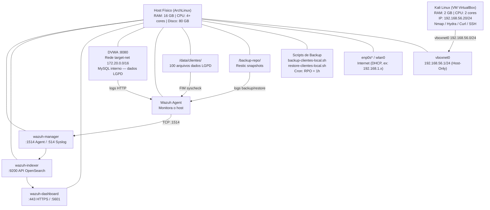
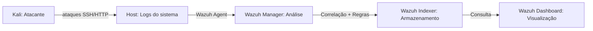
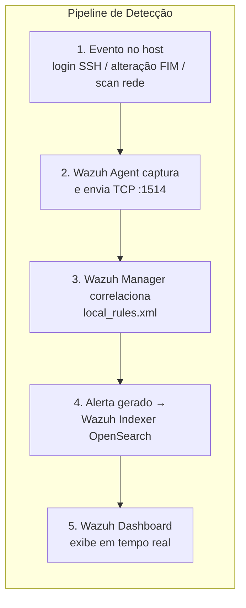
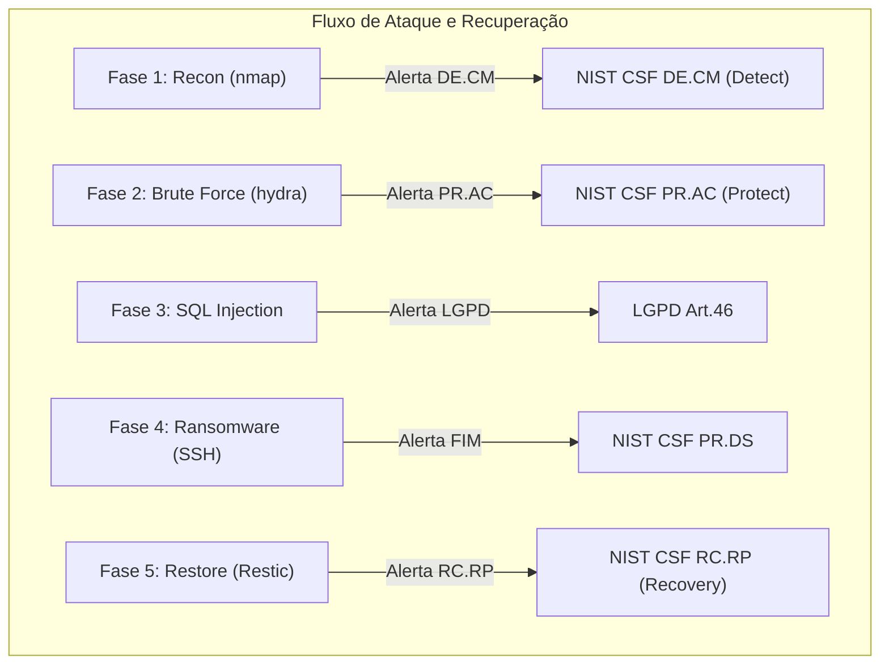

# Topologia do Ambiente

## Diagrama de Rede



## Portas Expostas

| Serviço | Porta | Destino | Descrição |
|---------|-------|---------|-----------|
| Wazuh Dashboard | 443 | Host → Internet | Interface web do Wazuh |
| Wazuh Manager | 1514 | Host → Docker | Comunicação com agentes |
| Wazuh Manager | 514 | Host → Docker | Syslog remoto |
| Wazuh Indexer | 9200 | Host → Docker | API REST do OpenSearch |
| DVWA | 8080 | Host → Docker | Web app vulnerável |
| Kali SSH | 22 | Kali → Host | Acesso remoto para ataques |

## Mapeamento de Dependências

### Wazuh Docker (clonado do upstream)
```
wazuh-docker/
└── single-node/
    ├── docker-compose.yml         ← Modificado (memoria 1g, imagens 4.9.0)
    ├── config/
    │   ├── wazuh_cluster/
    │   │   └── wazuh_manager.conf ← Modificado (syslog remote + custom rules)
    │   └── wazuh_indexer/
    │       └── wazuh.indexer.yml  ← Modificado (caminho dos certificados)
    └── generate-indexer-certs.yml ← Original
```

### Soc Corporativo (neste repositório)
```
soc-corporativo/
├── 00-aprendizado/              → Entender a ferramenta e conceitos
├── 01-arquitetura/              → Diagramas e topologia
├── 02-setup/                    → Scripts e guias de instalação
├── 03-configuração/             → Regras Wazuh e configs do agente
├── 04-operação/                 → Scripts de ataque e healthcheck
├── 05-resultados/               → Relatorios, dashboards e prints
└── 06-apresentacao/             → Slides e roteiro
```

## Fluxo de Dados

### Coleta de Logs


### Pipeline de Detecção


### Fluxo de Ataque e Recuperacao


## Requisitos de Hardware

| Componente | Mínimo | Recomendado |
|------------|--------|-------------|
| RAM | 12 GB | 16 GB |
| CPU | 4 cores | 8 cores |
| Disco | 60 GB | 120 GB (SSD) |
| SO | Arch Linux | Arch Linux |

## Referências

- [Wazuh Docker](https://github.com/wazuh/wazuh-docker) - Repositório oficial
- [Wazuh Documentation](https://documentation.wazuh.com/) - Documentação oficial
- [DVWA](https://github.com/digininja/DVWA) - Damn Vulnerable Web Application
- [Restic](https://restic.net/) - Ferramenta de backup
