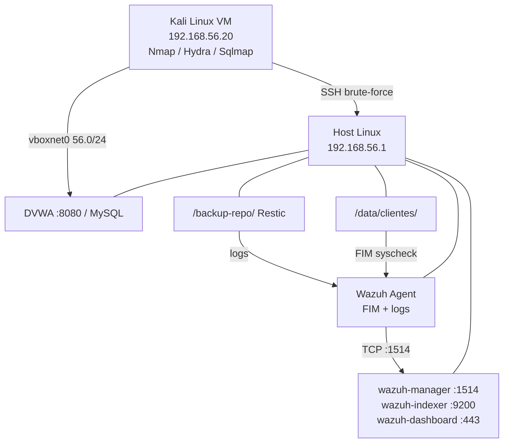

# SOC Corporativo com Wazuh

**SOC** que implementa um Centro de Operações de Segurança utilizando **Wazuh 4.9** como SIEM open source. O projeto simula ataques cibernéticos em ambiente controlado, detecta-os em tempo real e classifica-os conforme os frameworks **NIST CSF**, **ISO 27001** e **LGPD**.

---

## Visão Geral

O ambiente consiste em um host Linux executando a stack Wazuh em containers Docker, uma aplicação web vulnerável (DVWA) como alvo, e uma VM Kali Linux como atacante. Um pipeline completo de segurança é demonstrado em 5 fases:

```
Reconhecimento (Nmap) → Força Bruta SSH (Hydra) → SQL Injection (DVWA)
→ Ransomware Simulado (FIM) → Disaster Recovery (Restic)
```

Cada ataque gera alertas no Wazuh Dashboard com classificação automática por framework de compliance, demonstrando na prática como um SOC detecta, responde e se recupera de incidentes.

---

## Arquitetura



### Stack Tecnológica

| Componente | Tecnologia | Função |
|------------|-----------|--------|
| **SIEM** | Wazuh 4.9 (Docker) | Correlação de eventos, alertas, dashboard |
| **Alvo** | DVWA (Docker) | Aplicação web vulnerável com dados LGPD |
| **Atacante** | Kali Linux (VM) | Execução dos ataques simulados |
| **Backup** | Restic | Backup e restore com RPO/RTO mensuráveis |
| **Agente** | Wazuh Agent | Coleta de logs e FIM no host |
| **Compliance** | NIST CSF, ISO 27001, LGPD | 28 regras customizadas de classificação |

---

## Funcionalidades

- **Detecção em tempo real** de varredura de portas, força bruta SSH, SQL Injection, ransomware e恢复ação
- **28 regras customizadas** de compliance mapeadas para NIST CSF (12), ISO 27001 (5), LGPD (5), MITRE ATT&CK (4) e métricas (2)
- **Correlação avançada** de eventos (agregação temporal de falhas de autenticação)
- **FIM em tempo real** (File Integrity Monitoring) para 6 diretórios críticos
- **Dashboard interativo** com timeline, filtros por framework e métricas de severidade
- **Backup automatizado** com Restic (RPO 1h, RTO ~12min)
- **Suporte multi-plataforma:** Arch Linux, Ubuntu/Debian e Windows (WSL2)

---

## Pré-requisitos

| Recurso | Mínimo | Recomendado |
|---------|--------|-------------|
| RAM | 12 GB | 16 GB |
| CPU | 4 cores | 8 cores |
| Disco | 60 GB | 80 GB SSD |
| Docker | 24+ | 24+ |
| VirtualBox | 7.x | 7.x |

---

## Quick Start

### 1. Clone os repositórios

```bash
cd ~/Code
git clone https://github.com/wazuh/wazuh-docker.git -b 4.9.0
git clone https://github.com/SoNdA11/soc-corporativo.git
```

### 2. Suba o Wazuh

```bash
cd wazuh-docker/single-node
sed -i 's/ES_JAVA_OPTS=-Xms4g -Xmx4g/ES_JAVA_OPTS=-Xms1g -Xmx1g/g' docker-compose.yml
docker compose -f generate-indexer-certs.yml run --rm generator
docker compose up -d
```

### 3. Escolha seu SO e execute o setup

| Sistema | Guia | Script |
|---------|------|--------|
| **Arch Linux** | [`guia-de-setup.md`](02-setup/guia-de-setup.md) | `bash 02-setup/setup-opcao5.sh` |
| **Ubuntu/Debian** | [`guia-de-setup-ubuntu.md`](02-setup/guia-de-setup-ubuntu.md) | `bash 02-setup/setup-ubuntu.sh` |
| **Windows** | [`guia-de-setup-windows.md`](02-setup/guia-de-setup-windows.md) | Passo a passo manual (WSL2) |

### 4. Verifique a saúde do ambiente

```bash
bash soc-corporativo/04-operacao/healthcheck.sh
```

---

## Estrutura do Projeto

```
soc-corporativo/
├── README.md                  ← Documentação principal
├── LICENSE                    ← Licença MIT
├── .gitignore                 ← Arquivos ignorados
├── Makefile                   ← Automação (placeholder)
│
├── 00-aprendizado/            ─ Entender a ferramenta
│   ├── guia-de-estudo.md      # Guia completo para apresentação
│   └── guias-comandos.md      # Comandos e operações diárias
│
├── 01-arquitetura/            ─ Diagramas e topologia
│   ├── topology.md            # Topologia de rede detalhada
│   └── mapa-mental.md         # Mapas mentais (Mermaid)
│
├── 02-setup/                  ─ Instalação e configuração
│   ├── guia-de-setup.md       # Guia Arch Linux
│   ├── guia-de-setup-ubuntu.md# Guia Ubuntu/Debian
│   ├── guia-de-setup-windows.md# Guia Windows (WSL2)
│   ├── setup-opcao5.sh       # Script automatizado (Arch)
│   ├── setup-ubuntu.sh       # Script automatizado (Ubuntu)
│   ├── kali-attacker.md       # Criação da VM Kali
│   ├── lib/common.sh          # Funções compartilhadas
│   └── *.sh                   # Scripts de manutenção
│
├── 03-configuracao/           ─ Regras e configurações
│   ├── local_rules.xml        # 28 regras de compliance
│   ├── wazuh-agent.conf       # Configuração do agente
│   └── logrotate-soc.conf     # Rotação de logs
│
├── 04-operacao/               ─ Operação e testes
│   ├── ataques-opcao5.sh     # Script de ataque (5 fases)
│   └── healthcheck.sh         # Verificação pós-setup
│
├── 05-resultados/             ─ Evidências e entregas
│   ├── compliance-scorecard.ndjson  # Métricas exportáveis
│   └── prints/                # Screenshots do ambiente
│
├── 06-apresentacao/           ─ Relatório acadêmico (LaTeX)
│   └── apresentacao-ferramenta-wazuh.tex
│
└── 07-slides/                 ─ Slides da apresentação
    └── slides-wazuh.tex       # Beamer (8 slides)
```

---

## Cenário de Ataque

O script [`ataques-opcao5.sh`](04-operacao/ataques-opcao5.sh) automatiza as 5 fases:

| Fase | Ataque | Ferramenta | Alerta Wazuh | Severidade |
|------|--------|-----------|-------------|:----------:|
| F1 | Reconhecimento | Nmap | SID 200006 — NIST DE.CM | 8 |
| F2 | Força Bruta SSH | Hydra | SID 200003 → SID 200040 | 8 → 15 |
| F3 | SQL Injection LGPD | Curl + DVWA | SID 200031 — MITRE T1190 | 12 |
| F4 | Ransomware | SSH + mv | SID 200004 — NIST PR.DS | 9 |
| F5 | Disaster Recovery | Restic | SID 200033 — NIST RC.RP | 5 |

### Execução

No Kali Linux:

```bash
bash /home/paulo/Code/soc-corporativo/04-operacao/ataques-opcao5.sh
```

Acompanhe os alertas em tempo real no Wazuh Dashboard:
`https://localhost:443` (usuário: `admin`, senha: `SecretPassword`)

---

## Frameworks de Compliance

| Framework | Escopo | Regras |
|-----------|--------|:------:|
| **NIST CSF 1.1** | ID.AM, PR.AC, PR.DS, DE.CM, RC.RP | 12 |
| **ISO 27001:2013** | A.9.4.2, A.12.3.1, A.12.4.1, A.12.6.1, A.14.2.1, A.16.1.5 | 5 |
| **LGPD** | Art. 46, 48, 49 | 5 |
| **MITRE ATT\&CK** | T1046, T1110, T1190, T1486 | 4 |
| **Métricas** | Backup, Restore | 2 |
| **Total** | | **28** |

---

## Documentação Adicional

- [Guia de Estudo](00-aprendizado/guia-de-estudo.md) — Preparação para apresentação acadêmica
- [Guia de Comandos](00-aprendizado/guias-comandos.md) — Operação completa do ambiente
- [Topologia](01-arquitetura/topology.md) — Diagrama de rede detalhado
- [Relatório LaTeX](06-apresentacao/apresentacao-ferramenta-wazuh.tex) — Documentação acadêmica completa
- [Slides](07-slides/slides-wazuh.tex) — Apresentação em Beamer (8 slides)

---

<p align="center">
  <sub>Projeto acadêmico — Disciplina MDI 0209 (Segurança de Sistemas) — UERN 2026</sub>
</p>
